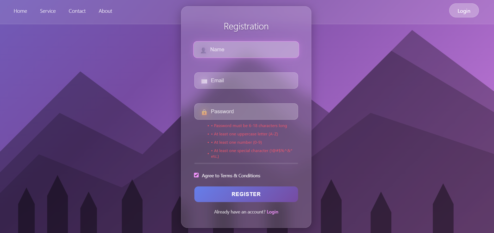

# login-register
Elegante formulario de registro con: ✨ Gradientes animados 🔒 Validación avanzada de contraseña ⚡ Efectos visuales interactivos 🌄 Diseño montañoso inmersivo 🛠 Vanilla JS + CSS3

**Mountain View Registration App**


   <div align="center" style="border: 1px solid #ddd; border-radius: 8px; padding: 10px; display: inline-block">
     
   </div>

Una elegante aplicación de registro con:  

✨ **Interfaz visual impresionante**  
- Gradientes animados y efectos de partículas flotantes  
- Diseño responsive que se adapta a cualquier dispositivo  
- Siluetas de montañas y árboles para una experiencia inmersiva  

🔒 **Validación robusta de contraseñas**  
- Longitud requerida: 6-18 caracteres  
- Requiere mayúsculas, minúsculas, números y caracteres especiales  
- Indicador visual de fortaleza en tiempo real  

⚡ **Funcionalidades clave**  
- Validación de formularios en tiempo real  
- Efectos visuales al enfocar campos  
- Animaciones durante el proceso de registro  
- Navegación suave entre secciones  

🛠 **Tecnologías utilizadas**  
- HTML5 semántico  
- CSS3 moderno con animaciones y gradientes  
- JavaScript vanilla (sin dependencias externas)  

🌐 **Características adicionales**  
- Diseño con glassmorphism (efecto vidrio esmerilado)  
- Sistema de notificaciones elegante  
- Efectos de hover interactivos  
- Compatibilidad cross-browser  

Perfecta para proyectos que requieren:  
✅ Un formulario de registro estético y funcional  
✅ Ejemplos de validación avanzada de contraseñas  
✅ Implementación de efectos visuales modernos  

---

**Instalación**  
```bash
git clone https://github.com/tu-usuario/mountain-view-registration.git
cd mountain-view-registration
```
```manual
Descarga el archivo .zip del repositorio.
Extrae los archivos (index.html, style.css, script.js, login.html).
Abre index.html en tu navegador (Chrome/Firefox/Edge).
```
**Personalización**  
Edita `style.css` para cambiar colores y efectos visuales. Modifica `script.js` para ajustar las validaciones.

---


